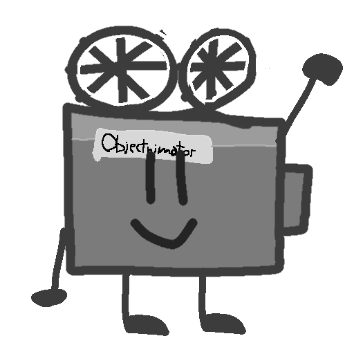

# Objectnimator
You realized that you want to create, for example, an Object show, but the programs you want to use to animate are premium, or is the free version very limited?, Well, here there is Objectnimator, a free and open source app to animate your object shows, YOU can help and give ideas, so if there is a problem, even YOU can fix those problems with coding.

>[!NOTE] 
> We recommend that you learn/know how to program in HTML, CSS, and JS, including Node JS, to develop. This is not focused on users who use it for animation, but rather on those who fix bugs or develop improvements for the app.

>[!IMPORTANT]
>For developers, we have to make a timeline, which is used for animation that uses keyframes, and that moves, also after that we should make the save system, recommended to use json or a custom file and that you parse it and load assets and animations without any problems almost.

Cinemy, Objectnimator's Mascot © 2025 by B4uti4GD is licensed under CC BY-NC 4.0