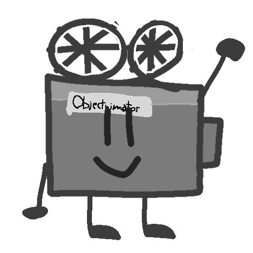

# Objectnimator
You realized that you want to create, for example, an Object show, but the programs you want to use to animate are premium, or is the free version very limited?, Well, here there is Objectnimator, a free and open source app to animate your object shows, YOU can help and give ideas, so if there is a problem, even YOU can fix those problems with coding.

>[!NOTE] 
>The program is not yet ready, as is the beginning of making the program, but we would recommend that you program in HTML, CSS, and JS, including Node JS, .

>[!WARNING] 
>The previous note should be removed when we have already done a part of code except for what language you should know how to program in, but this warning should be entirely removed.

Cinemy, Objectnimator's Mascot © 2025 by B4uti4GD is licensed under CC BY-NC 4.0