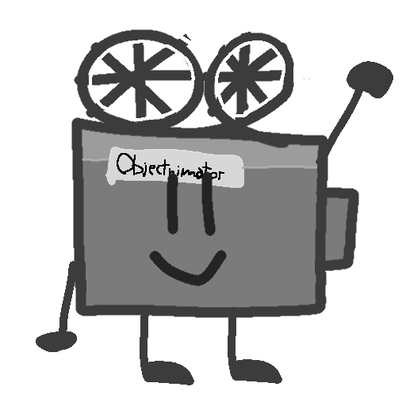

# Objectnimator 🎭

Did you realize you want to create, for example, an **Object Show**, but the animation programs you want to use are premium or their free versions are very limited? 

Well, here is **Objectnimator**! A free and open-source app to animate your object shows. **YOU** can help and provide ideas; if there is a problem, even **YOU** can fix it with coding.

Made with essential libraries for modern animation, such as OpenFL and Theatre.js

>[!IMPORTANT]
>**CURRENT STATUS (v1.1):** Editing is now fully functional! ✨ 
>Now featuring **Dynamic Text Rendering** ✍️! You can add, edit, and animate text layers directly in your scene. Import assets, transform objects, and animate sequences with real data persistence on your disc. Automatic `preview.html` generation is coming soon! ;DDDDD

>[!TIP]
>**Our updated milestones! 🚀**
>- **v1.1 (Current):** Dynamic Text Rendering & Layer Management ✍️🗂️
>- **v1.2:** Canvas Frame Capturing (Export your animation to video/frames!) 🎞️✨
>- **v1.3:** Vector Graphics & Shapes 🌟 and our API Automation Script (Probably)
>- **v1.4:** Motion Blur and GLSL Shaders Blueprints ☄️
>- **v1.5:** Audio Synchronization (Voices & SFX) 🔊
>- **v1.6:** Export Preview.html ;D

>[!NOTE] 
>We recommend that you know how to program in HTML, CSS, and JS to contribute to development. Currently, the focus is on developers fixing bugs or creating improvements for the app.

*Cinemy, Objectnimator's Mascot © 2025 by B4uti4GD is licensed under [CC BY-NC 4.0](https://creativecommons.org)*

---

<h2>Made by the contributors of this proyect :D</h2>
